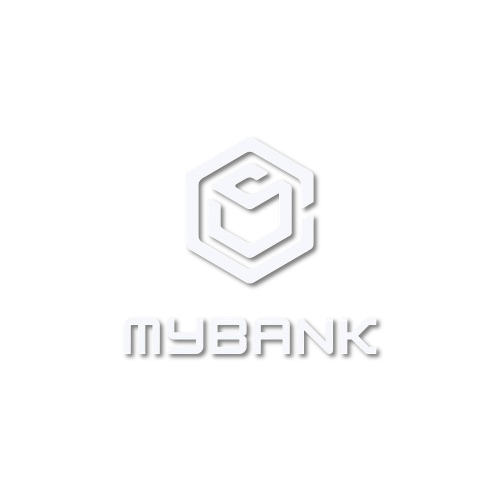

# 💳 MyBank

  

Projeto/Dashboard de banco digital desenvolvido para estudos

---

## 📚 Conceitos abordados
Durante o desenvolvimento deste projeto foram estudados conceitos importantes sobre a arquitetura do JavaScript e seu funcionamento:

- Fetch API  
- Threads  
- Concorrência  
- Paralelismo  
- Event Loop  
- Task Queue  
- Web Workers  
- Single Thread  
- MultiThread  

---

## 🛠 Tecnologias utilizadas
- HTML5  
- CSS3  
- JavaScript (ES6+)
